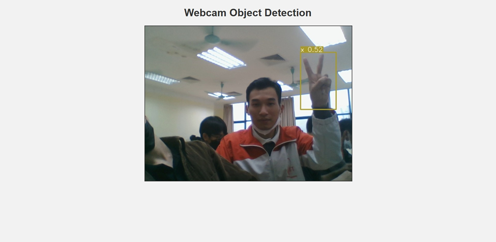

# **Connection Web**

+ Dự án xây dựng web hỗ trợ giao tiếp với người câm điếc.

## Mục đích

+ Web giúp người sử dụng có thể đọc được cử chỉ tay của người câm điếc thông qua webcam

## Các thành viên tham gia :

* Trần Văn Mạnh - B20DCCN430
* Nguyễn Khánh Nam - B20DCCN454
* Nguyễn Quang Hảo - B20DCCN226

## Công nghệ sử dụng :

+ Sử dụng ngôn ngữ lập trình python
+ Sử dụng công cụ labelImg là công cụ gán nhãn cho ảnh
+ Sử dụng yolov5 là mạng nơ ron hỗ trợ học sâu
+ Sử dụng opencv để xử lý video
+ Sử dụng Flask để thiết kế giao diện web

## Chức năng chính :

+ Giúp người tổ chức có thể đọc ngôn ngữ kí hiệu thông qua webcam

## Giao diện chính:

